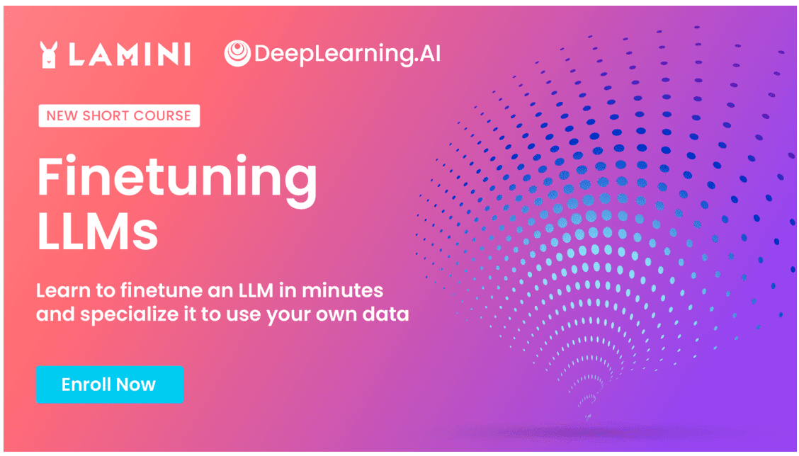

# Finetuning Large Language Models Course

Welcome to my repository for the "Finetuning Large Language Models" course! This course, taught by Sharon Zhou, co-founder and CEO of Lamini, is designed to enhance your proficiency in using Large Language Models (LLMs) for your own applications.

## Course Overview

In this short and practical course, you will learn essential finetuning concepts and how to train a large language model using your own data. With the guidance of an experienced instructor, you will explore the best use cases for finetuning LLMs, prepare your data for finetuning, and gain hands-on experience in training and evaluating an LLM on your data.

## Prerequisites

This is an intermediate program tailored for developers who have basic Python and PyTorch knowledge. Familiarity with these technologies will ensure a smoother learning experience throughout the course.

## Course Objectives

By the end of this course, you are be equipped with the knowledge and skills to incorporate the latest finetuning techniques and optimize your language model. You will gain the ability to generate transformative results using LLMs in your own applications. With the following module structure, you will progress through the course step by step:

1. Recognizing the best use cases for finetuning LLMs
2. Preparing your data for finetuning
3. Training and evaluating an LLM on your data

## Getting Started

To get started with this course, you can clone this repository to access the course materials with my solutions, including code examples and additional resources. You will find everything you need to follow along with the course.

Let's dive into the world of finetuning Large Language Models and unlock their full potential in your applications!